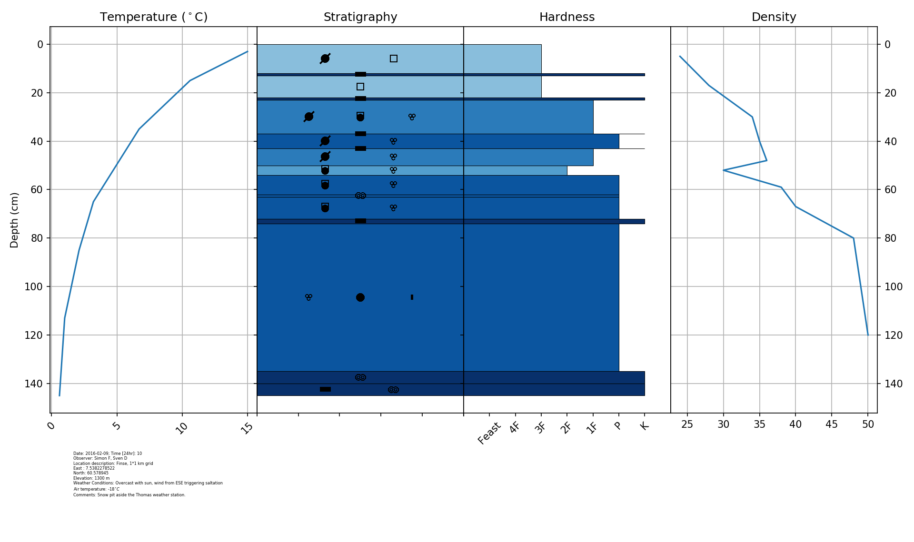

# Snowpyt: an open-source library to visualize snowpits in Python
Simon Filhol, November 2016, copyright under the MIT license terms, see the License.txt file

LAST MODIFIED: March 2018 (or see date on github file history)

Feel free to contribute to the project!!!! Many new features can be added...

## To do:

### High Priority

- write function to save and load pit to and from pickle format (currently not working)
- make ground appear to comfirm the user that the pit reached ground. add note about ground type.

### Low priority 
- specify the figure size and adjust font size in respect
- render the medatadata text better, convert date to a readable date
- put option to adjust figure size to desired size and dpi. Return axis variable from plotting function for more advanced plotting if needed (i.e. multiple samples)
- add option to save pits in Pickle format or CSV
- add option to save figure in matplotlib format
- add option to plot when multiple sample columns are given.


## Objective
The objective of this library is to provide visualization tool for snowpit data. 
Started for the need of the Svalbard Snow Research group, this package should evolve
 to include more snowpit type and visualization scheme. 

The snow grain classification follows the guidelines provided by the UNESCO 
[International Classification for Seasonal Snow on the Ground](http://unesdoc.unesco.org/images/0018/001864/186462e.pdf) 
(Fierz et al., 2009)

Fierz, C., Amstrong, R.L., Durand, Y., Etchevers, P., Greene, E., McClung, D.M., Nishimura, K., Satyawali, P.K. and Sokratov, S.A. 2009.The International Classification for Seasonal Snow on the Ground. IHP-VII Technical Documents in 
Hydrology N°83, IACS Contribution N°1, UNESCO-IHP, Paris. 

## Installation

### Last stable version from the Pypi repository

Simply run the following in your terminal:
```bash
pip install snowpyt
```
### Last development version for contributing to the project:

Clone the github repository to a local directory using the following command in your terminal

```bash
git clone https://github.com/ArcticSnow/snowpyt.git
```
or by downloading the package

The branch 'master' consists of the latest stable version. Other develepment versions are included in other git branches.

The package contains all the functions to plot the Snowpyt if library requirements are met. It also contains data samples to test the library. Message us to be added as a contributor, then if you can also modify the code to your own convenience with the following steps:

To work on a development version and keep using the latest change install it with the following
```bash
pip install -e [path2folder/snowpyt]
```
and to upload latest change to Pypi.org, simply:

1. change the version number in the file `snowpyt/__version__.py`
2. run from a terminal from the snowpyt folder, given your `$HOME/.pyc` is correctly set:

```bash
python setup.py upload
```

### requirements

Python 2.7.9 with the following libraries:
- [numpy](http://www.numpy.org/)
- [matplotlib](http://matplotlib.org/)
- [pandas](http://pandas.pydata.org/)
- xlrd
- xlm

## Use

1. There are three ways to import data into Snowpyt:

   1. digitalize your pit with https://niviz.org/ and export your pit as a CAAMLv6 (This format follows an international standard for snowpit). Them use the import_caamlv6() function.

      More information about the [CAAML format](http://caaml.org/)

   2. digitalize you snowpit using the excel file template in the [excel file example here](https://github.com/ArcticSnow/snowpyt/blob/master/snowpyt/data_example/20170209_Finse_snowpit.xlsx). Save the excel or libreoffice file in .xslx format (default Excel format).

   3. input directly data into the snowpit class object

      ​

3. Example:

```python
from snowpyt import pit_class as pc

############################################################
# Example 1 - using a caamlv6 file:


p = pc.Snowpit()
p.caaml_file= '[PATH TO YOUR FILE].caaml'
p.import_caamlv6()
p.plot(plots_order=['density', 'temperature', 'stratigraphy', 'hardness'])

p.plot(metadata=True)
p.plot(plots_order=['density', 'temperature', 'stratigraphy','crystal size'])

# import isotope values (dD, dO18, d-ex)
p.isotopes_file = '[PATH TO YOUR FILE].csv'
p.import_isotope_csv()

p.plot(plots_order=['dD', 'd18O','d-ex', 'hardness'])

```

The isotope `.csv` file should be following this format:
```
number,height_top,height_bot,dD,d18O,dxs,ice_type
0,94,93.0,-57.55,-8.16,7.73,S
1,93,89.8,-61.56,-8.76,8.54,S
2,89.8,86.6,-75.45,-10.64,9.68,S
```

4. All the data table are loaded as a Pandas dataframe or Numpy arrays within the snowpyt class object

Type the following in your Python console to see the loaded datatable:
```python
mypit.table

```
This allows for custom plotting using the library of your choice on top of the existing plotting function

6. Extra Sample Values

Extra column of sample values can be added to the excel file. **Column name must be unique**

The current plotting functions will not plot these extra columns, only the first one. However the values are loaded via pandas in the table as a dataframe (see 5.)


## Want to contribute?
Once you have cloned the project to your home directory, create a git branch and here you go. When your edits are stable, merge with the master branch. See this neat tutorial about git branching and merging, [here](https://git-scm.com/book/en/v2/Git-Branching-Basic-Branching-and-Merging)

### List of Contributor
- Simon Filhol
- Guillaume Sutter
- [add your name]

## Example



