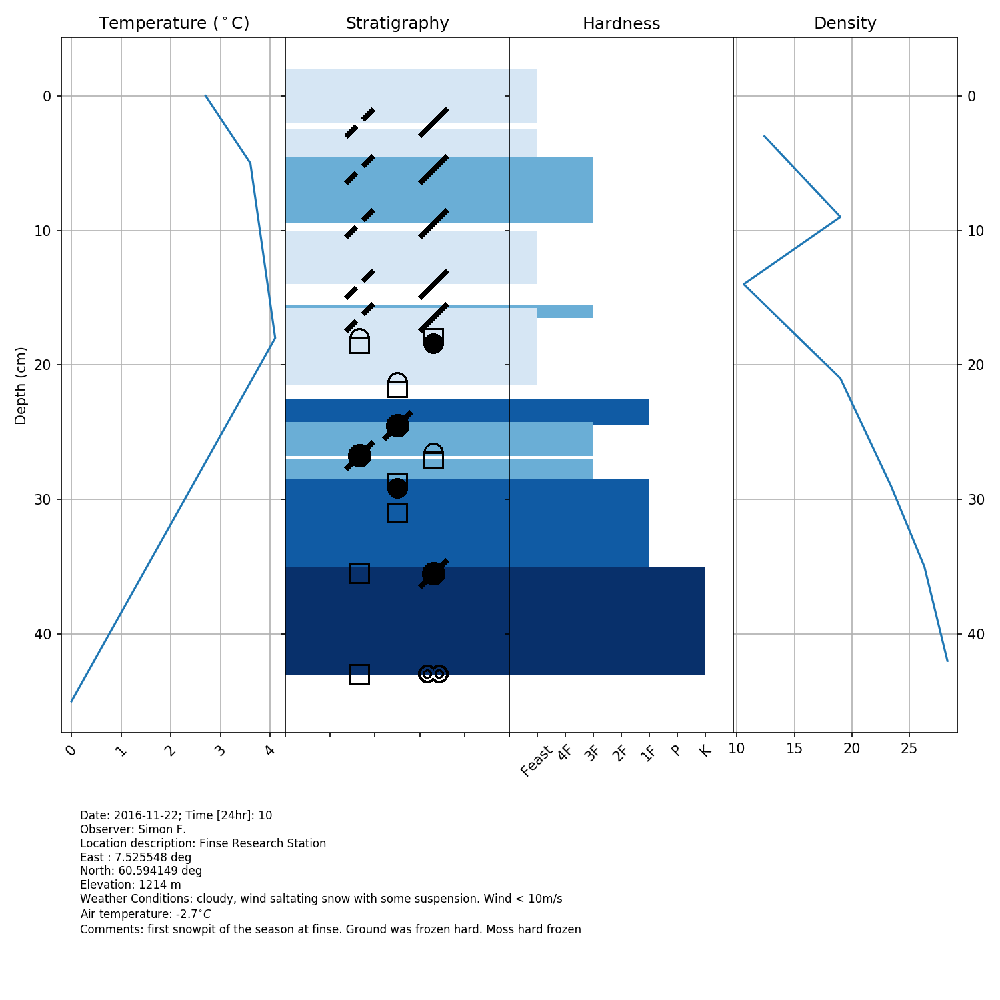

# Snowpyt: an open-source library to visualize snowpits in Python
Simon Filhol, November 2016, copyright under the MIT license terms, see the License.txt file

Feel free to contribute to the project!!!! Many new features can be added...

To do:
- add more crystal symbols
- improve the final layout (e.g. overlapping snowflake symbol)
- specify the figure size and adjust font size in respect
- render the medatadata text better
- create new plot combination
- put option to adjust figure size to desired size and dpi


## Objective
The objective of this library is to provide visualization tool for snowpit data. 
Started for the need of the Svalbard Snow Research group, this package should evolve
 to include more snowpit type and visualization scheme. 
 
The snow grain classification follows the guidelines provided by the UNESCO 
[International Classification for Seasonal Snow on the Ground](http://unesdoc.unesco.org/images/0018/001864/186462e.pdf) 
(Fierz et al., 2009)

Fierz, C., Amstrong, R.L., Durand, Y., Etchevers, P., Greene, E., McClung, D.M., Nishimura, K., Satyawali, P.K. and Sokratov, S.A. 2009.The International Classification for Seasonal Snow on the Ground. IHP-VII Technical Documents in 
Hydrology N°83, IACS Contribution N°1, UNESCO-IHP, Paris. 

## Installation
Clone the github repository to a local directory using the following command in your terminal

```bash
git clone https://github.com/ArcticSnow/snowpyt.git
```
or by downloading the package

The package contains all the functions to plot the snowpit if library requirements are met. It also contains data samples to test the library.

### requirements

Python 2.7.9

required library:
- [numpy](http://www.numpy.org/)
- [matplotlib](http://matplotlib.org/)
- [pandas](http://pandas.pydata.org/)

## Use

1. Snowpit must be formated following the template file "Standard_pit.xlsx"
2. Export the snowpit to a csv file using tab as delimiter
3. Individual snowpits have to be loaded into python class object from which the user can easily access information. See the file Example.py for an example of a basic use.

## Want to contribute?
Once you have cloned the project to your home directory, create a git branch and here you go. When your edits are stable, merge with the master branch. See this nice tutorial about git branching and merging, [here](https://git-scm.com/book/en/v2/Git-Branching-Basic-Branching-and-Merging)


## Example



