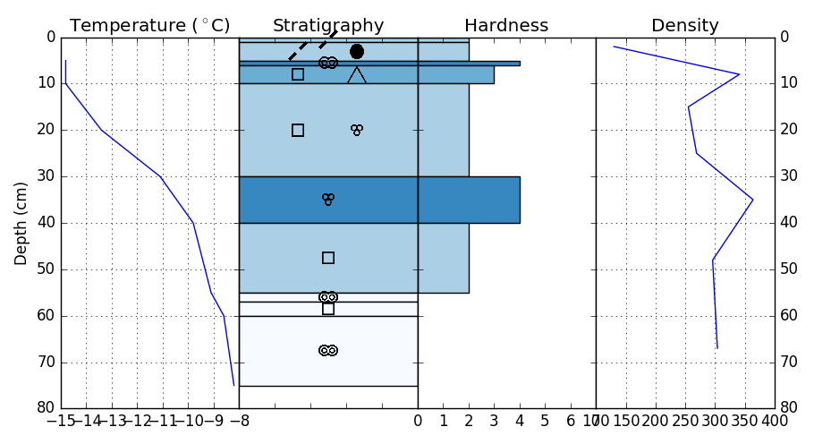

# Snowpyt: Library to visualize snowpits
Simon Filhol, November 2016, copyright under the MIT license

Feel free to contribute to the project!!!!

## Objective
The objective of this library is to provide visualization tool for snowpit data. 
Started for the need of the Svalbard Snow Research group, this package should evolve
 to include more snowpit type and visualization scheme. 
 
The snow grain classification follows the guidelines provided by the UNESCO 
[International Classification for Seasonal Snow on the Ground](http://unesdoc.unesco.org/images/0018/001864/186462e.pdf) 
(Fierx et al., 2009)

Fierz, C., Amstrong, R.L., Durand, Y., 
Etchevers, P., Greene, E., McClung, D.M., 
Nishimura, K., Satyawali, P.K. and Sokratov, S.A. 2009.
The International Classification for Seasonal Snow on the Ground. IHP-VII Technical Documents in 
Hydrology N°83, IACS Contribution N°1, UNESCO-IHP, Paris. 

## Installation

### requirements

Python 2.7.9

required library:
- numpy
- matplotlib
- pandas

## Use

## Example

